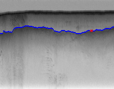

*This is a report for Assignment 3 of the course Elements of Artificial Intelligence, CSCI-B 551, Fall 2021.*

*Created by Sripad Joshi (joshisri), MS in Computer Science

## Ice tracking**

**Aim:**
For a given radar echogram, detect the air-ice boundary and ice-bedrock boundary

**Assumptions:**
(as given in the a3-fa2021 pdf)
- **a**.The air-ice boundary is always above the ice-bedrock boundary by margin of say 10 pixels
- **b** Both these boundaries span across the image
- **c** The boundaries are assumed to be smooth along the columns

**Approaches for boundary detection**

### **simple (Bayes' Net)**

Here, we use the pre-implemented *edge_strength* method to get the edge strength. The stronger the edge(higher pixel value) the higher the probability of it being the boundary. So we use the edge strength matrix for a given image and convert the pixel values to probabilities (**emission probability**).

For a given image, for each column, we picked two row indices of highest probabilitiy values with a condition that they are atleast 10 pixels apart.  Of the two picked row indices, the value at lower row index represents the air-ice boundary pixel, the value at higher row index represent the ice-bedrock boundary pixel (because of the assumption **a**, which says air-ice boundary is always above ice-bedrock boundary)

Example results

|  |
|:--:| 
| 09.png simple air-ice boundary |

|  |
|:--:| 
| 09.png simple ice-bedrock boundary |

But this approach fails for a difficult case where only using the edge strength is not enough for the boundary detection

|  |
|:--:| 
| 23.png simple air-ice boundary |

|  |
|:--:| 
| 23.png simple ice-bedrock boundary |

### **HMM (Viterbi)**

Next we use viterbi algorith to solve for the boundaries.

For the viterbi algorithm - we use the same emission probabilities as before.

For transition probabilities, we take into account the assumption of *"smoothness"*

So, for a given row and column, the transition probability of going to the next column's same row is highest. The row above and below have lower transition probabilities. The transition probability for rows far below or above are set to 0.

* After calculating the air-ice boundary, used the part of the image below with the boundary to calculate the ice-bedrock boundary.

Example results

|  |
|:--:| 
| 31.png viterbi air-ice boundary |

|  |
|:--:| 
| 31.png viterbi ice-bedrock boundary |

The difficult example which didn't work well with simple:

|  |
|:--:| 
| 23.png Viterbi air-ice boundary |

|  |
|:--:| 
| 23.png Viterbi ice-bedrock boundary |

Here we see a huge improvement  over simple algorithm for image 23.png after using viterbi.

### **HMM (Viterbi) with human feedback**

In this approach, we use human feedback to further improve the boundary detection.

We divide the problem into two sub problems, one detecting the boundary from the human feedback point to the starting column backwards, other from the human feedback point to the last column in forward direction. Here, we set the initial probabilties for the viterbi algorithm such that the human feedback row has the highest initial probability value.
This improves the outputs further. Below are example outputs.

Example outputs:

|  |
|:--:| 
| 30.png viterbi - human feedback air-ice boundary |

|  |
|:--:| 
| 30.png viterbi human feedback  ice-bedrock boundary |

The difficult example which didn't work well with simple:

|  |
|:--:| 
| 23.png Viterbi - human feedback air-ice boundary |

|  |
|:--:| 
| 23.png Viterbi -  human feedback ice-bedrock boundary |

